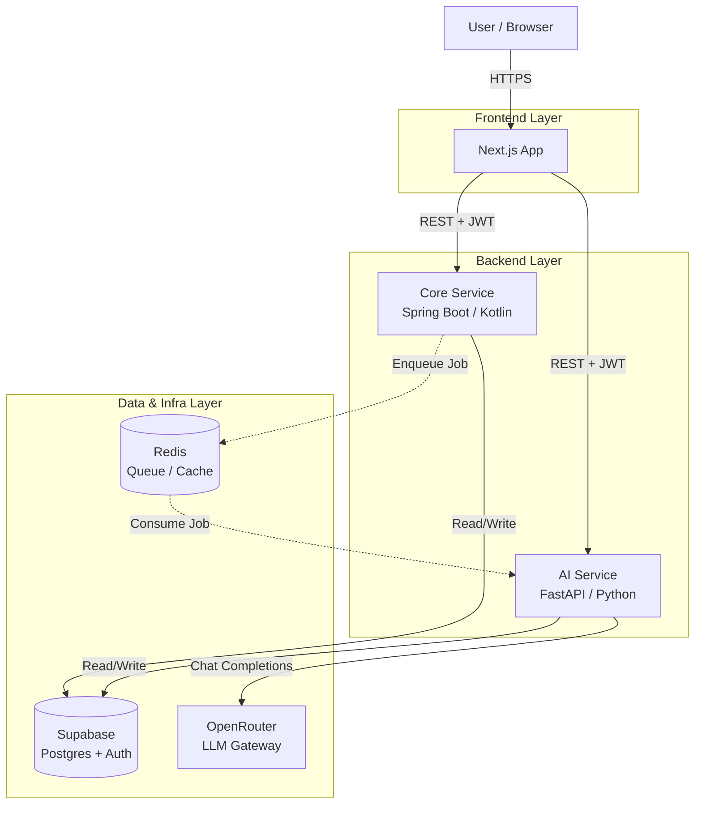
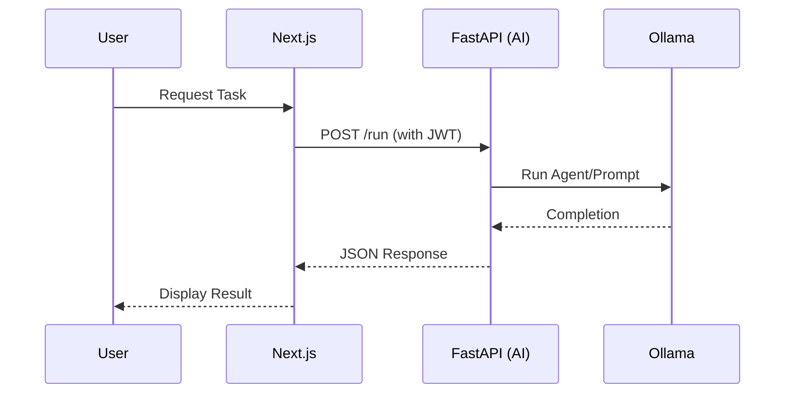
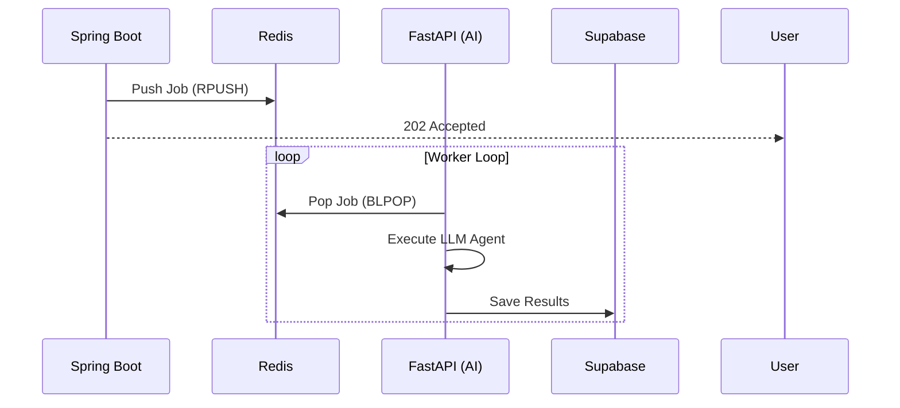

# Alfred System Architecture Design Document

## 1. Overview

**Alfred** is a polyglot microservices system designed to demonstrate a robust, scalable architecture for AI/ML applications. It integrates a modern frontend, an enterprise-grade core backend, a specialized Python AI service, and a managed data/auth platform.

The primary design goal is **Separation of Concerns**:
*   **Next.js**: Handles UI/UX and orchestration.
*   **Spring Boot (Kotlin)**: Manages core business logic, strict typing, and transactions.
*   **FastAPI (Python)**: Specialized environment for LLM inference and AI agent execution (CodeAgent).
*   **Supabase**: Centralized source of truth for Identity (Auth) and Data (Postgres).

## 2. High-Level Architecture

The system follows a microservices pattern where services communicate primarily via REST APIs (secured by JWTs) and optionally via asynchronous message queues (Redis) for long-running tasks.

## 3. Components

### 3.1 Frontend (Next.js)
*   **Role**: User Interface and "Backend for Frontend" (BFF).
*   **Tech**: TypeScript, React Server Components, Server Actions.
*   **Responsibilities**:
    *   Authenticating users via Supabase Auth.
    *   Routing user requests to appropriate backend services.
    *   Rendering real-time updates (via Supabase Realtime).

### 3.2 Core Service (Spring Boot)
*   **Role**: The "Enterprise" backbone.
*   **Tech**: Kotlin, Spring Boot 3.
*   **Responsibilities**:
    *   Complex domain logic and business rules.
    *   Structured data validation.
    *   High-performance transaction management.
    *   Orchestrating workflows that require consistency.

### 3.3 AI Service (FastAPI) - *Current Repository*
*   **Role**: The AI/ML computational engine.
*   **Tech**: Python 3.12+, FastAPI, OpenAI SDK (Chat Completions) via OpenRouter.
*   **Responsibilities**:
    *   **LLM Agent Execution**: Uses `CodeAgent` to autonomously solve tasks.
    *   **Inference**: Connects to local LLMs (e.g., Qwen2 via Ollama) or remote APIs.
    *   **Task Processing**: Handling computationally intensive AI jobs.
*   **Current Implementation Details**:
    *   Exposes a REST API (`/run`, `/fibonacci`).
    *   Manages a global `LLMEngine` lifecycle.
    *   Integrates `PythonInterpreterTool` for code execution capabilities.

### 3.4 Data & Auth (Supabase)
*   **Role**: Unified Data and Identity Provider.
*   **Tech**: PostgreSQL, GoTrue (Auth).
*   **Responsibilities**:
    *   **Single Source of Truth**: All user data resides here.
    *   **Auth**: Issues JWTs used by all services.
    *   **RLS (Row Level Security)**: Enforces data access policies at the database level.

## 4. Communication Patterns

### 4.1 Synchronous Flow (REST)
Used for immediate user feedback (e.g., "Generate a quick summary").

### 4.2 Asynchronous Flow (Redis Queue)
Used for long-running tasks (e.g., "Analyze this large dataset").

## 5. Security Architecture

1.  **Authentication**:
    *   Users log in via Next.js + Supabase.
    *   Supabase issues a JWT (JSON Web Token).
    *   This JWT is passed in the `Authorization: Bearer` header to both Spring Boot and FastAPI.

2.  **Authorization**:
    *   **Service-Level**: Middleware in FastAPI/Spring validates the JWT signature using the Supabase project secret.
    *   **Data-Level**: PostgreSQL Row Level Security (RLS) policies ensure services can only access data permitted for that user (or via a Service Role for admin tasks).

## 6. Development Setup

### AI Service (Local)
The `alfred` directory contains the AI Service.

*   **Requirements**: Python 3.12.
*   **Environment Variables**:
    *   `OPENROUTER_API_KEY`: OpenRouter API key.
    *   `OPENROUTER_MODEL`: Target model (default: `openai/gpt-4o-mini`).
*   **Run Command**: `./run_server.sh`