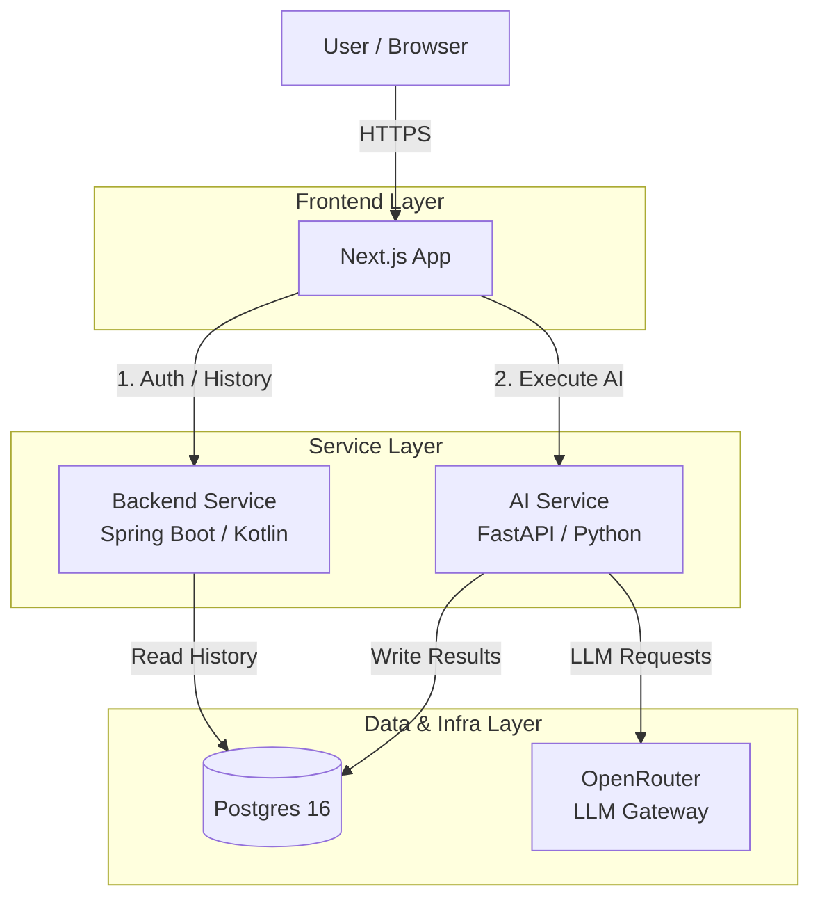
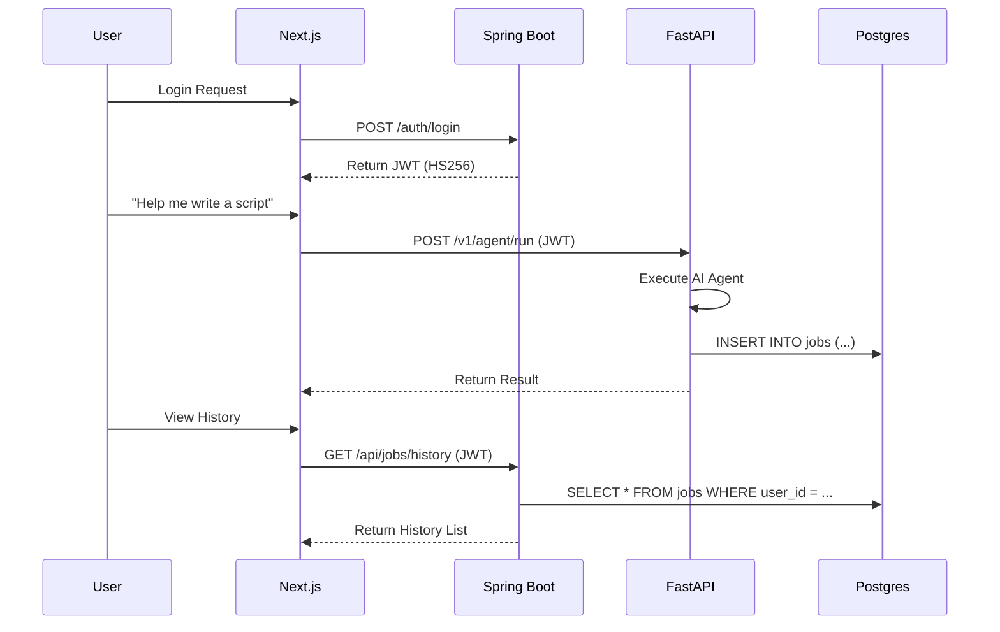

# Alfred Architecture

## 1. Overview

**Alfred** is a polyglot microservices system designed for AI-driven task execution. It follows a **Decoupled & Frontend-Driven** architecture, where the frontend orchestrates communication between specialized services.

The primary design goal is **Separation of Concerns**:
*   **Next.js (Frontend)**: The central coordinator. Manages UI/UX, handles authentication flows with the Backend, and triggers AI execution directly.
*   **Spring Boot (Backend Service)**: The "System of Record". Manages identity (Auth), user preferences, and historical data.
*   **FastAPI (AI Service)**: The "Intelligence Engine". Specialized in LLM inference and agentic execution.
*   **Postgres (Shared Database)**: The shared persistence layer that allows services to coexist without direct coupling.

## 2. High-Level Architecture

The system avoids direct service-to-service calls between the Backend and AI services. Instead, they share a database but remain independent in their execution logic.

## 3. Core Principles

### 3.1 Frontend-Driven Orchestration
Next.js is responsible for "stitching" the services together. It communicates with Spring Boot for management tasks (Auth, settings, history) and with FastAPI for performance-sensitive AI tasks.

### 3.2 Shared Database, No Direct Link
Spring Boot and FastAPI do not call each other's APIs.
- **FastAPI** writes the results of AI jobs directly to the `jobs` table in Postgres.
- **Spring Boot** reads from the `jobs` table to serve historical data to the user.
This decoupling ensures that the Backend service remains stable even if the AI service is under heavy load or being updated.

### 3.3 Stateless Security (JWT)
Security is handled statelessly using JWTs signed with a shared `JWT_SECRET` (HS256).
1.  **Spring Boot** issues a JWT upon successful login.
2.  **Next.js** stores the JWT and includes it in the `Authorization` header for all requests.
3.  **FastAPI** independently verifies the JWT signature using the shared secret to authorize AI execution.

## 4. Components

### 4.1 Frontend (Next.js 15)
- **Role**: UI and Orchestrator.
- **Dual API Clients**:
    - **Client A**: Targets Spring Boot for Auth and History.
    - **Client B**: Targets FastAPI for AI Execution.

### 4.2 Backend Service (Spring Boot / Kotlin)
- **Role**: System of Record & Identity Provider.
- **Responsibilities**:
    - Managing the `users` table.
    - Issuing and refreshing JWTs.
    - Serving historical AI job data (Read-only access to `jobs`).

### 4.3 AI Service (FastAPI / Python)
- **Role**: Intelligence & Execution.
- **Responsibilities**:
    - Verifying JWTs for stateless authorization.
    - Executing LLM agents (using `smolagents` library).
    - Writing results directly to the `jobs` table.

### 4.4 Shared Postgres 16
- **`users` table**: Owned/Managed by Spring Boot.
- **`jobs` table**: Written by FastAPI, Read by Spring Boot.

## 5. Sequence: The "Triangle" Flow

