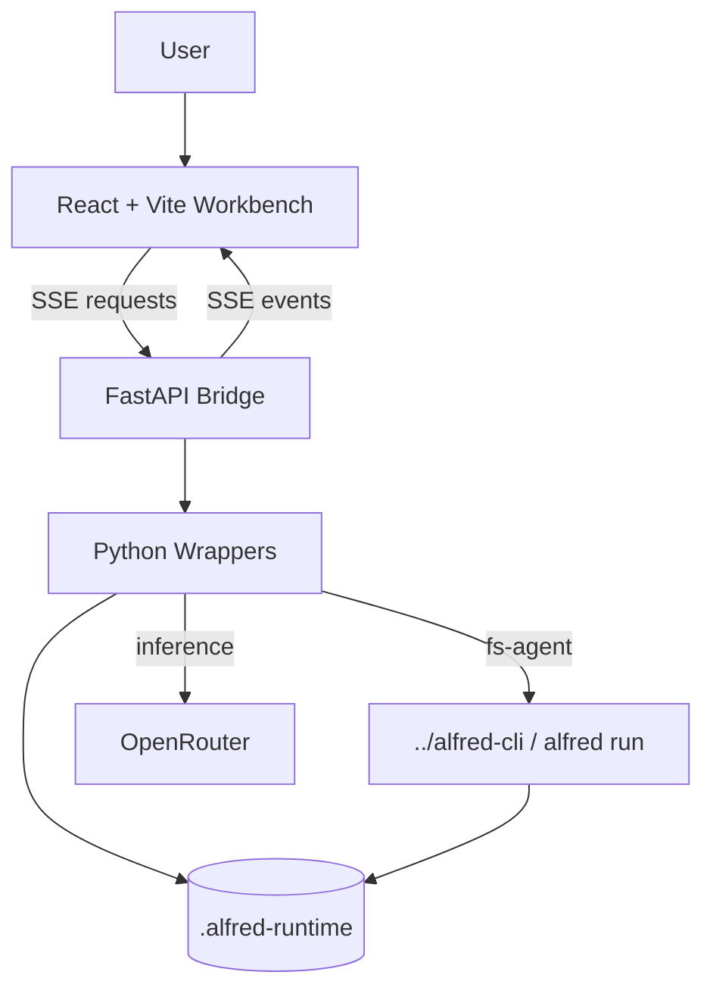

# Alfred Local Workbench Architecture

## Overview

This repository is a local-first orchestration layer around the Rust `alfred` binary in `../alfred-cli`.

- **React + Vite workbench**: single-page local UI for prompt submission and streamed output
- **FastAPI bridge**: local-only API that relays requests to Python wrappers
- **Python wrappers**: inference, filesystem-agent execution, and web-grounded helper scripts
- **Rust `alfred` binary**: filesystem-capable agent runtime
- **Filesystem runtime**: session logs, artifacts, and results under `.alfred-runtime/`

## Flow

```mermaid
graph TD
    User[User]
    UI[React + Vite Workbench]
    API[FastAPI Bridge]
    PY[Python Wrappers]
    CLI[../alfred-cli / alfred run]
    FS[(.alfred-runtime)]
    LLM[OpenRouter]

    User --> UI
    UI -->|SSE requests| API
    API --> PY
    PY -->|inference| LLM
    PY -->|fs-agent| CLI
    PY --> FS
    CLI --> FS
    API -->|SSE events| UI
```

## Responsibilities

### FastAPI bridge

- Exposes `/health`, `/api/infer/stream`, and `/api/fs-agent/stream`
- Owns no business logic beyond request validation and SSE relaying
- Reports `alfred` binary availability to the frontend

### Python wrapper layer

- Creates session directories and persists request/event/result files
- Runs Python-side inference via `smolagents`
- Runs quick research helpers via Python
- Invokes `alfred run` for filesystem-capable work
- Normalizes outputs into `meta`, `delta`, `artifact`, `done`, and `error` events

### Rust CLI dependency

The Python filesystem wrapper assumes a non-interactive CLI contract in `../alfred-cli`:

- Command: `alfred run`
- Input: prompt, cwd, mode flags
- Output: JSONL/ACP-aligned structured events over stdout

The current TUI-only binary is not sufficient for that path; the CLI repo must expose this interface.
