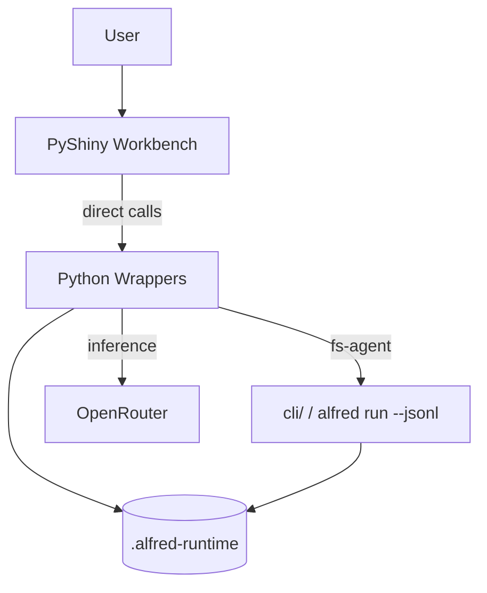
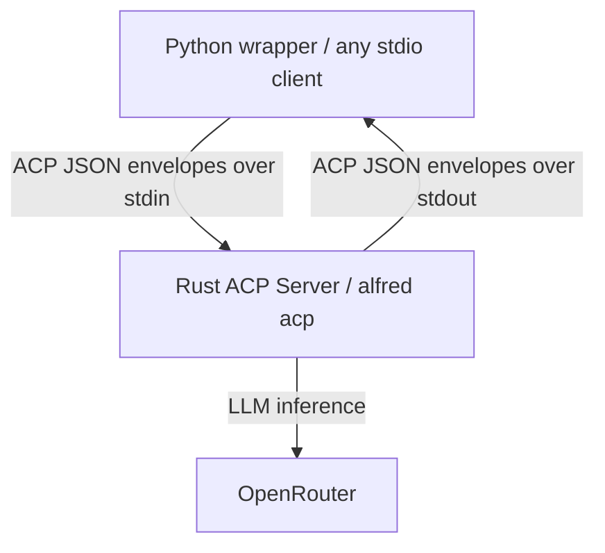

# Alfred Local Workbench Architecture

## Overview

This repository is a local-first orchestration layer around the Rust `alfred` binary in `cli/`.

- **PyShiny workbench**: local UI for prompt submission and streamed output; imports Python wrappers directly
- **Python wrappers**: inference, filesystem-agent execution, and web-grounded helper scripts
- **Rust `alfred` binary**: filesystem-capable agent runtime with TUI and ACP transport
- **Filesystem runtime**: session logs, artifacts, and results under `.alfred-runtime/`

## Flow

### Current State (JSONL Subprocess Bridge)


```mermaid
graph TD
    User[User]
    UI[PyShiny Workbench]
    PY[Python Wrappers]
    CLI[cli/ / alfred run --jsonl]
    FS[(.alfred-runtime)]
    LLM[OpenRouter]

    User --> UI
    UI -->|direct calls| PY
    PY -->|inference| LLM
    PY -->|fs-agent| CLI
    PY --> FS
    CLI --> FS
```

The PyShiny workbench imports and calls Python wrapper functions directly.

### ACP Transport Scaffold (`alfred acp`)


```mermaid
graph TD
    Client[Python wrapper / any stdio client]
    ACP_CLI[Rust ACP Server / alfred acp]
    LLM[OpenRouter]

    Client -->|ACP JSON envelopes over stdin| ACP_CLI
    ACP_CLI -->|ACP JSON envelopes over stdout| Client
    ACP_CLI -->|LLM inference| LLM
```

The `alfred acp` subcommand implements an Agent Communication Protocol (ACP) server over stdio. It reads JSON envelopes from stdin and writes event envelopes to stdout.

**Client → Server**

```
{ "type": "session.start", "session_id": "<uuid>", "cwd": "<path>" }
{ "type": "prompt.send",   "prompt": "<text>", "mode": "<mode>" }
{ "type": "session.cancel" }
{ "type": "session.close" }
```

**Server → Client**

```
{ "type": "meta",          "session_id": "...", "cwd": "...", "backend": "...", "transport": "acp", "version": "1" }
{ "type": "delta",         "content": "<text>" }
{ "type": "tool_request",  "name": "<tool>", "arguments": {...} }
{ "type": "tool_result",   "name": "<tool>", "output": "...", "is_error": false }
{ "type": "artifact",      "label": "...", "path": "...", "url": null }
{ "type": "done",          "result": "completed" }
{ "type": "error",         "message": "...", "exit_code": null }
```

The ACP transport is not yet wired into the Python bridge (`scripts/fs_agent.py` still uses the legacy `--jsonl` subprocess mode). Integration is tracked as follow-up work.

## Responsibilities

### Python wrapper layer (`scripts/`)

- `common.py`: session management, JSONL helpers, SSE formatting, binary resolution
- `fs_agent.py`: runs filesystem-agent requests via `alfred run --jsonl` subprocess, fallback to `smolagents`
- `chat.py`: Python-side inference via `smolagents` / `llm`
- `research.py`: web-grounded research helpers

### Rust ACP server (`cli/crates/alfred-cli/src/acp.rs`)

- Handles `alfred acp` CLI entrypoint: stdio server mode
- Session lifecycle: `session.start` → `prompt.send` → streaming events → `session.close`
- Reuses `alfred-core` for agent execution (agent loop, provider calls)
- Emits ACP-compliant JSON envelopes to stdout; diagnostics to stderr

### Rust CLI binary (`cli/`)

- `alfred` — TUI chat mode (default)
- `alfred run --jsonl --prompt <text>` — legacy scriptable mode
- `alfred acp` — ACP stdio transport (scaffold, not yet integrated)

## Environment Variables

| Variable               | Default                              | Purpose                                      |
|------------------------|--------------------------------------|----------------------------------------------|
| `ALFRED_CLI_BIN`       | auto-resolve from `cli/target/`      | Path to `alfred` binary                      |
| `ALFRED_RUNTIME_ROOT`  | `.alfred-runtime`                    | Root for all session/event storage           |
| `ALFRED_AGENT_MODE`    | `fs-agent`                           | Default agent mode                           |
| `OPENROUTER_API_KEY`   | *(required)*                         | LLM provider key                             |
